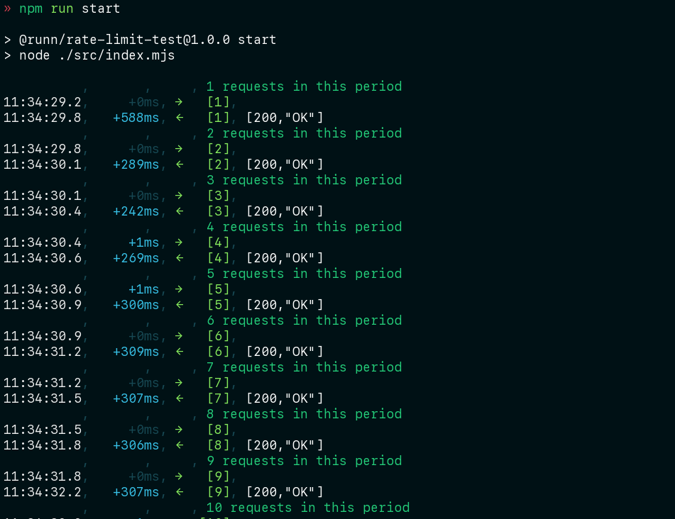

# rate limit test

## installation

```bash
npm install
```

## usage

```bash
npm run start
```

The script will start making requests to https://app.runn-testing.net, trying
to keep under the rate limit of 120 requests per minute.


